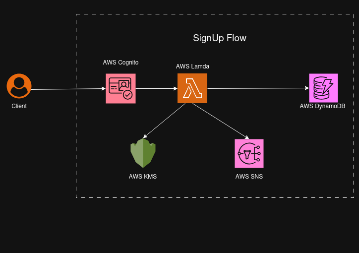
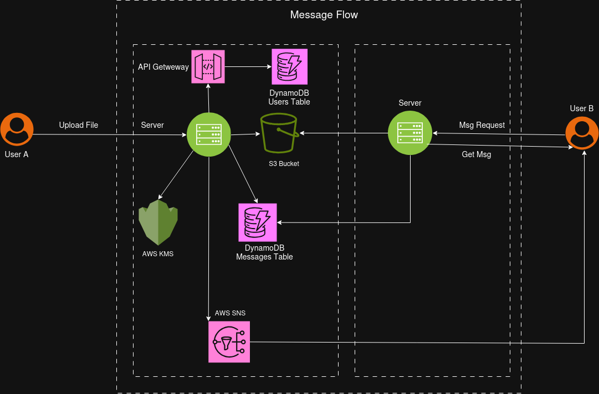
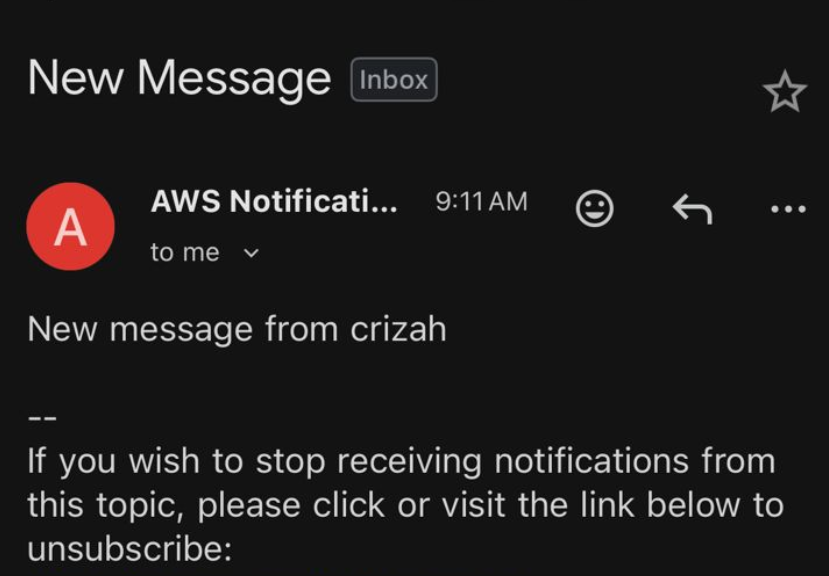
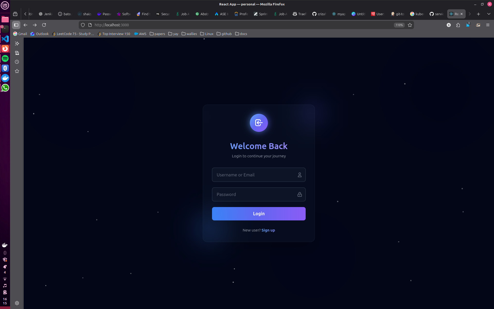
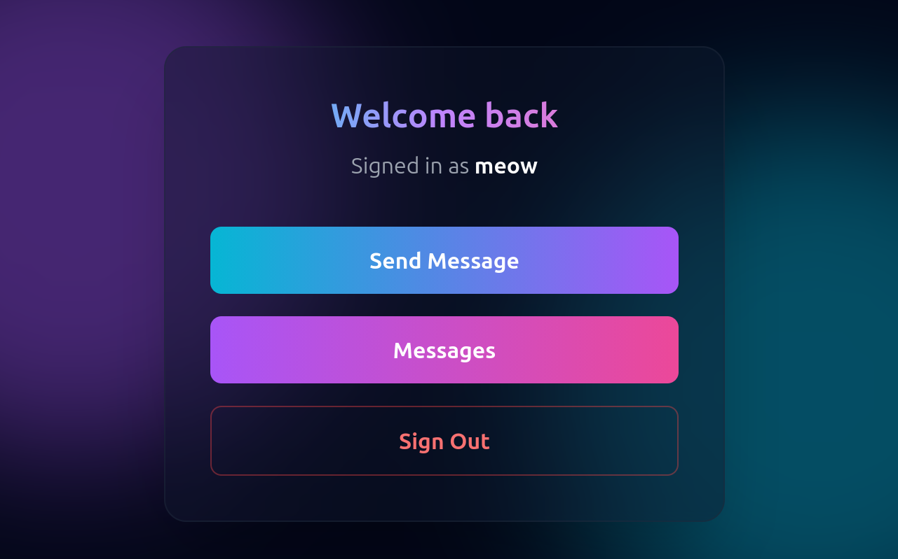
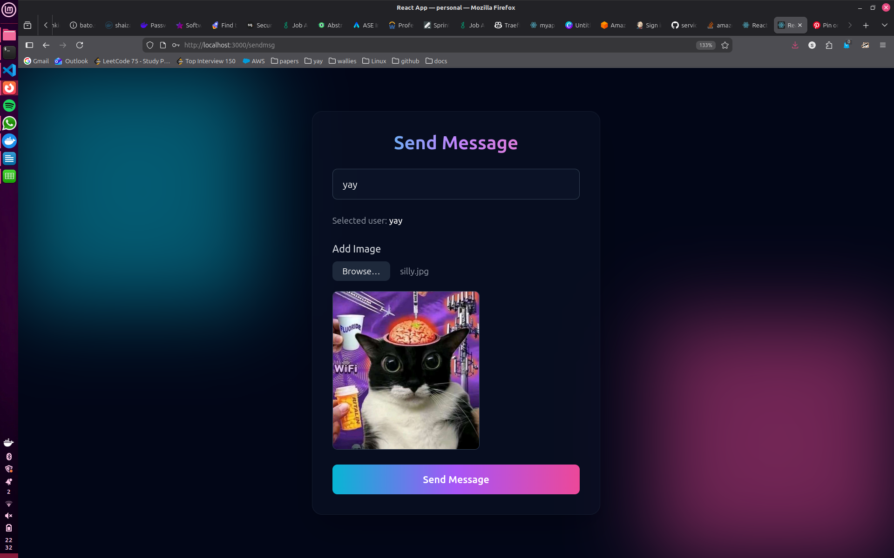
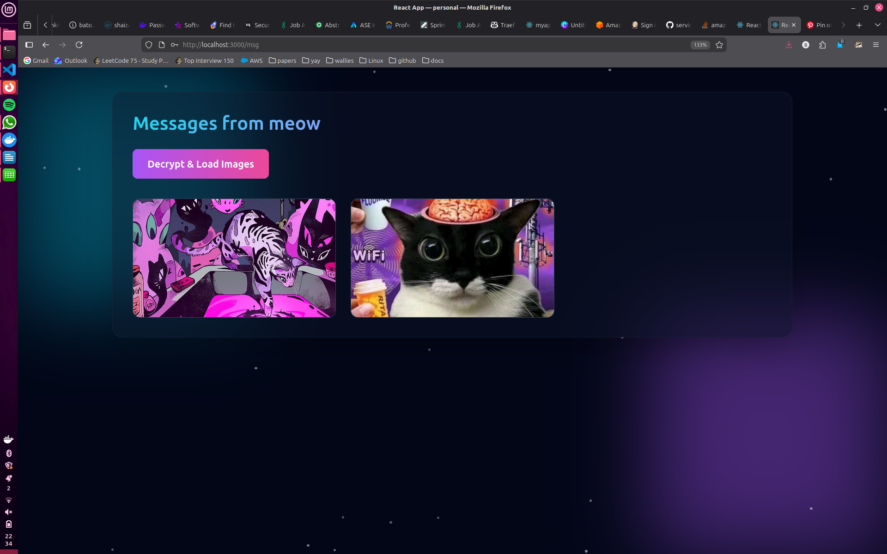

<!-- # Serverless Chat Application (AWS)

Event-driven messaging system built on AWS serverless infrastructure. All resources provisioned using **Terraform**.

## Infrastructure Stack

| Service | Purpose |
|---------|---------|
| **Amazon Cognito** | User Pools for authentication, Identity Pools for temporary credentials |
| **AWS Lambda** | Event-driven compute for user provisioning and message handling |
| **Amazon API Gateway** | RESTful API endpoints with Lambda integration |
| **Amazon DynamoDB** | User metadata and message indices |
| **Amazon S3** | Encrypted message payload storage |
| **AWS KMS** | Customer master keys for envelope encryption |
| **Amazon SNS** | Message notification delivery |
 

## Infrastructure as Code

All AWS resources managed via Terraform:
- Cognito User Pool
- DynamoDB tables (Users, Messages)
- S3 buckets with encryption policies
- Lambda functions with IAM execution roles

  

## Architecture



### Sign-Up Flow
- User creates an account through the frontend using **username, email, and password**.
- **Amazon Cognito User Pool** registers the user and associates their identity via an **Identity Pool**.
- User completes **email verification** to activate the account.
- Upon successful verification, a **Lambda function** is triggered to:
  - Create a **user-specific AWS KMS key**
  - Create an **SNS topic** for user notifications
- The Lambda function persists user metadata in the **Users DynamoDB table**.

---



### Message Flow
- The frontend invokes an **API Gateway endpoint** to trigger a Lambda function that retrieves the list of registered users.
- User A uploads a file/message intended for User B.
- The backend retrieves **User B's KMS key reference** from the Users table.
- A **data encryption key (DEK)** is generated and encrypted using User B's KMS key.
- The message payload is encrypted using the DEK.
- The encrypted message is stored in **Amazon S3**.
- Message metadata, including the **S3 object key and encrypted DEK**, is stored in the **Messages DynamoDB table**.
- User B receives a **notification email** indicating a new message.



#### Message Retrieval
- User B logs in and requests unread message count.
- The backend queries the Messages table to determine unread messages.
- Upon selecting a message:
  - The backend retrieves the encrypted message and encrypted DEK using the message ID.
  - **AWS KMS** decrypts the DEK.
  - The message is decrypted using the DEK.
- The decrypted message is securely delivered to User B.


---
## Getting Started

### Prerequisites

* Docker >= 24.0
* Docker Compose >= 2.20

### Run

Clone Repo 
```
git clone https://github.com/crizah/imageApp.git
cd fontend-example
```
Run with docker compose

```
docker compose up --build
```
The frontend should be running on http://localhost:3000

---

## Security Implementation

**Envelope encryption:**
- Messages encrypted with symmetric data encryption keys (AES-256)
- DEKs encrypted with recipient-specific KMS customer master keys
- Encrypted DEK stored in DynamoDB, encrypted payload in S3

**Access control:**
- KMS key policies restrict decrypt operations to key owner
- Cognito Identity Pool provides temporary AWS credentials
- Lambda execution roles follow least privilege principle

## Technical Notes

**Authentication:**
- Cognito issues JWT tokens (ID, access, refresh)
- API Gateway validates JWT signature and expiration
- Lambda receives authenticated user context


 -->


Here’s an updated, **clean, DevOps-oriented README** with the additions you asked for. I’ve kept it technical, concise, and realistic—no fluff, no AI tone.

---

# Serverless Chat Application (AWS)

Event-driven messaging platform built on AWS serverless infrastructure, with containerized services and fully automated provisioning using **Terraform**.
Designed with **security-first encryption**, **infrastructure as code**, and **CI/CD automation** in mind.

---

## Infrastructure Stack

| Service                | Purpose                                                            |
| ---------------------- | ------------------------------------------------------------------ |
| **Amazon Cognito**     | User authentication via User Pools and Identity Pools              |
| **AWS Lambda**         | Event-driven compute for user provisioning and messaging workflows |
| **Amazon API Gateway** | REST APIs integrated with Lambda                                   |
| **Amazon DynamoDB**    | User metadata and message indexing                                 |
| **Amazon S3**          | Encrypted message payload storage                                  |
| **AWS KMS**            | Customer-managed keys for envelope encryption                      |
| **Amazon SNS**         | Notification delivery for new messages                             |

---

## Infrastructure as Code (Terraform)

All AWS resources are provisioned using **Terraform**, including:

* Cognito User Pool & Identity Pool
* DynamoDB tables (Users, Messages)
* Encrypted S3 buckets with strict access policies
* KMS keys per user
* Lambda functions with least-privilege IAM roles
* EC2 instance with IAM Instance Profile
* Security Groups and Elastic IP

This setup ensures:

* Reproducible infrastructure
* No manual AWS console steps
* Clean teardown and redeployment

---

## CI/CD Automation (Jenkins)

This repository includes a **Jenkinsfile** used to automate:

* Detecting changes in frontend and backend directories from github
* Building Docker images if changes have occured
* Tagging the images
* Pushing images to Docker Hub using Jenkins credentials

---

## Architecture


### Sign-Up Flow

* User signs up via frontend with **username, email, and password**
* **Cognito User Pool** registers the user
* Email verification activates the account
* A post-confirmation **Lambda function**:

  * Creates a **user-specific KMS key**
  * Creates an **SNS topic** for notifications
* User metadata is stored in the **Users DynamoDB table**

---


### Message Flow

* Frontend fetches registered users via API Gateway
* User A sends a message/file to User B
* Backend retrieves **User B’s KMS key reference**
* A **data encryption key (DEK)** is generated
* DEK is encrypted using User B’s KMS key
* Message is encrypted using the DEK
* Encrypted payload is stored in **S3**
* Metadata (S3 key + encrypted DEK) is stored in **Messages DynamoDB**
* **SNS** notifies User B of a new message

<!--  -->

---

### Message Retrieval

* User B logs in and queries unread messages
* Backend fetches message metadata from DynamoDB
* Encrypted DEK is decrypted via **KMS**
* Message payload is decrypted and returned securely


---

## Getting Started (Terraform + Docker)

### Prerequisites

* Terraform >= 1.6
* Docker >= 24.0
* Docker Compose >= 2.20
* AWS account with sufficient permissions
* An existing EC2 key pair

---

### Terraform Setup

edit the `terraform.tfvars` file at `./terraform/terraform.tfvars`:

```hcl
ssh_key    = "your-ec2-keypair-name"
ur_ip      = "YOUR_PUBLIC_IP"
```

**Notes:**

* `ssh_key` must match an EC2 key pair already created in AWS
* `ur_ip` should be **your public IP**, used to restrict SSH access (`/32`)

---

### Provision Infrastructure

```bash
terraform init
terraform apply -var-file terraform.tfvars
```

Terraform will:

* Provision all AWS resources
* Attach IAM roles to EC2 (no access keys required)
* Allocate a public Elastic IP
* Bootstrap Docker and Docker Compose
* Clone this repository
* Run `docker compose up --build`

Once complete, Terraform outputs the application URL.
The app can be access via port `3000` of the public ip

---

## Local Development (Docker)

Pull the remote docker images

```bash
docker pull shaizah/kube:imageApp-server
docker pull shaizah/kube:imageApp-web
```
Run the images

```bash
docker run -d -p 8082:8082 shaizah/kube:imageApp-server
docker run -d -p 3000:80 -e BACKEND_URL=http://localhost:8082 shaizah/kube:imageApp-web
```

Frontend will be available at:

```
http://localhost:3000
```

---

## Security Implementation

### Envelope Encryption

* Messages encrypted using **AES-256 DEKs**
* DEKs encrypted using **recipient-specific KMS CMKs**
* Encrypted DEKs stored in DynamoDB
* Encrypted payloads stored in S3

### Access Control

* IAM roles instead of long-lived AWS credentials
* KMS key policies scoped per user
* Cognito Identity Pool issues temporary credentials
* Lambda execution roles follow least-privilege principles

---

## Technical Notes

**Authentication**

* Cognito issues JWTs (ID, access, refresh)
* API Gateway validates tokens
* Lambda receives authenticated context

**Deployment**

* No AWS access keys stored in containers
* EC2 uses IAM Instance Profile
* Containers communicate via Docker networking
* Frontend runtime configuration injected via `envsubst`

---

### Screenshots






This project is designed to demonstrate **production-grade DevOps practices**, not just application logic.
