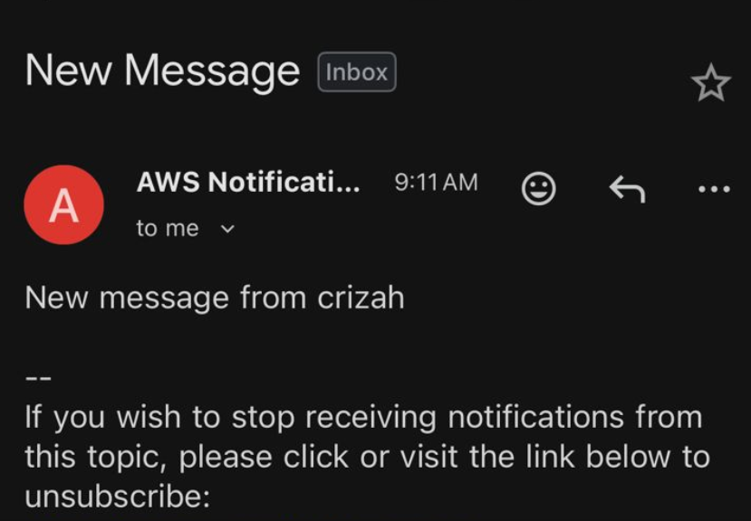
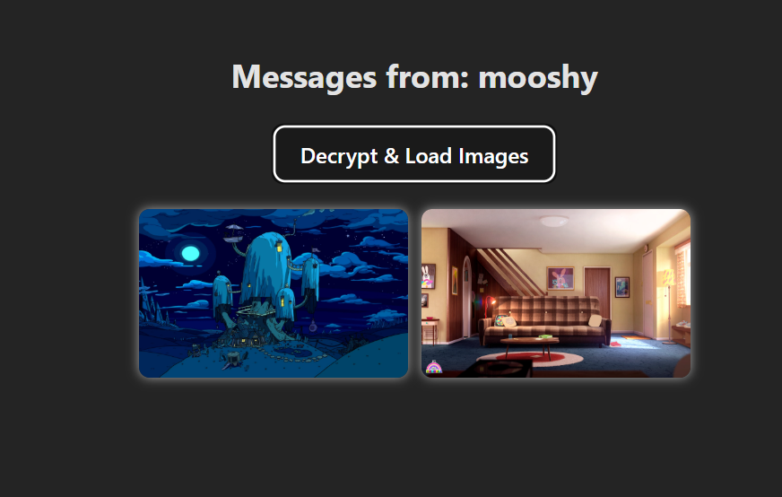

# Secure Real-Time Chat Application (AWS Serverless)

## Overview
Designed and implemented a **secure, serverless real-time chat application** using AWS cloud services. The system emphasizes **scalability, low latency, and strong data security**, following modern cloud-native and encryption-first design principles.

---

## AWS Services Utilized
| AWS Service | Usage |
|------------|-------|
| Amazon Cognito | Handles user authentication and authorization using Cognito User Pools and Identity Pools |
| AWS Lambda | Triggered on user sign-up to generate user-specific credentials (including KMS keys) and add user metadata in DynamoDB |
| Amazon API Gateway | Exposes REST APIs that invoke Lambda functions to retrieve and manage application data (e.g., list of registered users) |
| Amazon DynamoDB | Stores encrypted user profiles, chat metadata, and message references in a NoSQL database |
| Amazon S3 | Stores encrypted chat message payloads and related objects |
| AWS Key Management Service (KMS) | Manages encryption keys used to encrypt and decrypt all stored message data |
| AWS SNS | Used to send an email to the user when they get a new message|

---

## Security & Encryption
- Implemented end-to-end secure data handling using AWS-managed encryption mechanisms.
- All application data is stored only in encrypted form in backend storage.
- AWS KMS is used for key management and encryption control.
- Secure communication is enforced via HTTPS across all APIs.
- Password management and authentication is implemented using AWS Cognito

---

## Architecture

### Sign-Up Flow
- User creates an account through the frontend using **username, email, and password**.
- **Amazon Cognito User Pool** registers the user and associates their identity via an **Identity Pool**.
- User completes **email verification** to activate the account.
- Upon successful verification, a **Lambda function** is triggered to:
  - Create a **user-specific AWS KMS key**
  - Create an **SNS topic** for user notifications
- The Lambda function persists user metadata in the **Users DynamoDB table**.

---

### Message Flow
- The frontend invokes an **API Gateway endpoint** to trigger a Lambda function that retrieves the list of registered users.
- User A uploads a file/message intended for User B.
- The backend retrieves **User B’s KMS key reference** from the Users table.
- A **data encryption key (DEK)** is generated and encrypted using User B’s KMS key.
- The message payload is encrypted using the DEK.
- The encrypted message is stored in **Amazon S3**.
- Message metadata, including the **S3 object key and encrypted DEK**, is stored in the **Messages DynamoDB table**.
- User B receives a **notification email** indicating a new message.

  

#### Message Retrieval
- User B logs in and requests unread message count.
- The backend queries the Messages table to determine unread messages.
- Upon selecting a message:
  - The backend retrieves the encrypted message and encrypted DEK using the message ID.
  - **AWS KMS** decrypts the DEK.
  - The message is decrypted using the DEK.
- The decrypted message is securely delivered to User B.

 

---

## Conclusion
This project demonstrates the successful design and implementation of a **secure, serverless real-time chat application** using AWS managed services. The application achieves **scalability, low operational overhead, and strong security guarantees** through a cloud-native, event-driven architecture.

Key achievements include:
- Implementation of **user-specific encryption** using AWS KMS, ensuring that all message data is stored and processed only in encrypted form.
- End-to-end integration of **authentication, API management, compute, and storage** using AWS Cognito, API Gateway, Lambda, DynamoDB, and S3.
- Secure message handling using **envelope encryption**, balancing strong security with performance and scalability.
- A fully serverless architecture that eliminates infrastructure management while enabling automatic scaling.
- Practical consideration of **cost and resource management**, reflected in the controlled decommissioning of cloud resources after development and testing.

Overall, this project highlights hands-on experience with **secure cloud architecture, serverless application design, and real-world AWS service integration**, making it a strong demonstration of applied cloud engineering and security-focused system design.

