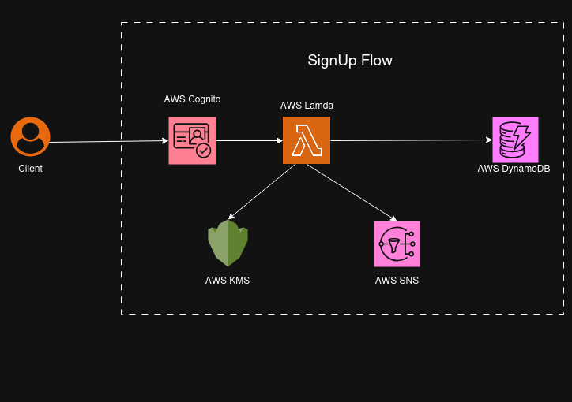
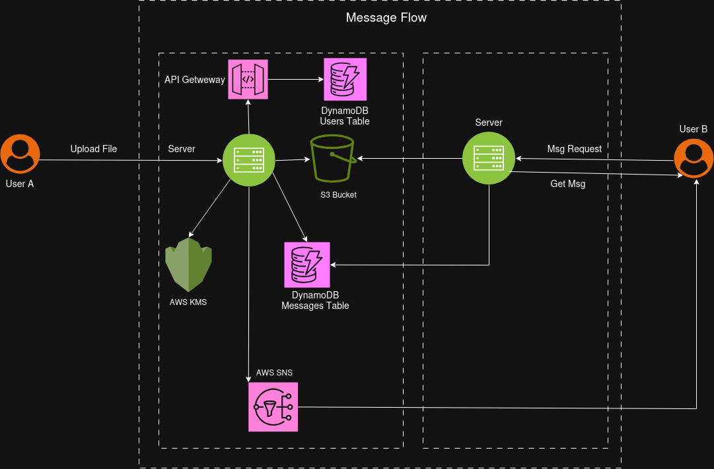
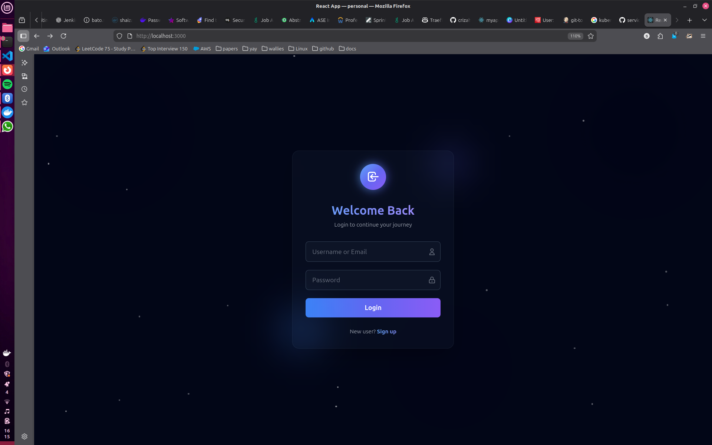
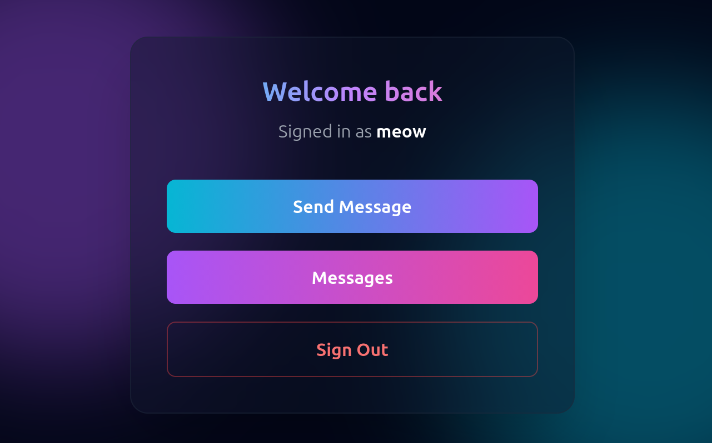
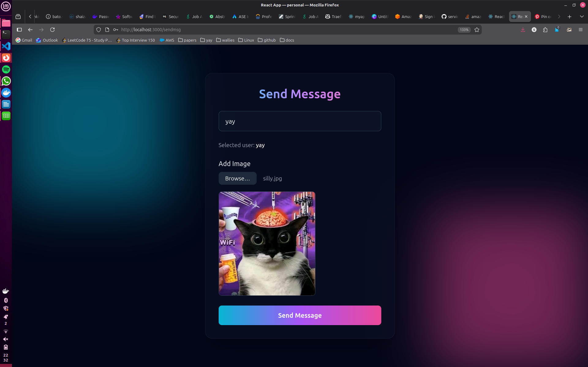
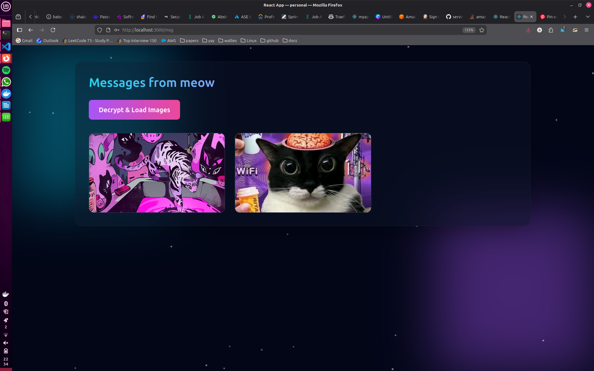

# Serverless Chat Application (AWS)

A production-ready, event-driven chat application leveraging AWS serverless architecture with end-to-end encryption, automated infrastructure provisioning, and CI/CD pipelines. Built to demonstrate enterprise-grade DevOps practices and cloud-native development.

---
## Technical stack
The technoligies used: 

| Service                | Technology used                                                  |
| ---------------------- | ------------------------------------------------------------------ |
| **Frontend**     |Built in React using Tailwind CSS        |
| **Backend**         | Built in Golang, contains, JWT-based user authentication|
| **AWS services** | Built on AWS serverless infrastructure                               |
| **Terraform**    | Used to provison all the AWS servcies                             |
| **Docker**          | Used to containerise each component of the app                             |
| **Docker compose**            | Used to run and manage the multicontainer application              |
| **Jenkins**         | Pipeline to automate building and pushing of Docker images                            |


### Repository Structure
```
.
├── server/               # Go server (Cognito integration, encryption logic)
├── web/                   # React frontend (Tailwind CSS)
├── terraform/             # All .tf files for AWS provisioning
│   ├── cognito.tf
│   ├── dynamodb.tf
│   ├── ec2.tf
│   ├── lambda.tf
│   └── s3.tf
├── lambda/                # Python function for post-signup hooks
├── docker-compose.yml     # Multi-container orchestration
├── Jenkinsfile            # CI/CD pipeline definition
└── README.md
```


## AWS Services used
All the AWS services used: 

| Service                | Purpose                                                            |
| ---------------------- | ------------------------------------------------------------------ |
| **Amazon Cognito**     | User authentication via User Pools and Identity Pools              |
| **AWS Lambda**         | Event-driven compute for user provisioning and messaging workflows |
| **Amazon API Gateway** | REST APIs integrated with Lambda                                   |
| **Amazon DynamoDB**    | User informtaion and Message metadat                             |
| **Amazon S3**          | Encrypted message payload storage                                  |
| **AWS KMS**            | Customer-managed keys for envelope encryption                      |
| **Amazon SNS**         | Notification delivery for new messages                             |
| **Amazon EC2**         | Deploy the application|

---

## Infrastructure as Code (Terraform)
All AWS resources are provisioned using **Terraform**, including:
* 100% Terraform-managed: All the AWS resources are defined in .tf files
* Reproducible deployments: Clone repo → terraform apply → fully functional app
* Terraform makes an EC2 instance, installs the dependencies, clones the repo inside it and runs it with docker compose.
* Immutable infrastructure: Destroy and recreate entire stack in minutes

---

## CI/CD Automation (Jenkins)

This repository includes a **Jenkinsfile**:
* GitHub webhook integration: Detecting changes in frontend and backend directories from github upon a new commit
* Builds the accosiated docker image and tags it appropriately.
* Pushes the tagged image to docker hub
 ### Stages
 ```
 1. Checkout Code (GitHub webhook trigger)
 2. Detect Changes (compare git diff in ./server/ or ./web/)
 3. Build Docker Images (only if changes detected)
 4. Tag Images 
 5. Push to Docker Hub using credentials 
```

---

## Docker compose
This is a multi container application and docker compose is used to run and manage the containers.

## Architecture



### Sign-Up Flow

* User signs up via frontend with **username, email, and password**
* **Cognito User Pool** registers the user
* Email verification activates the account
* A post-confirmation **Lambda function**:

  * Creates a **user-specific KMS key**
  * Creates an **SNS topic** for notifications
* User metadata is stored in the **Users DynamoDB table**

---



### Message Flow

* Frontend fetches registered users via API Gateway
* User A sends a message/file to User B
* Backend retrieves **User B’s KMS key reference**
* A **data encryption key (DEK)** is generated
* DEK is encrypted using User B’s KMS key
* Message is encrypted using the DEK
* Encrypted payload is stored in **S3**
* Metadata (S3 key + encrypted DEK) is stored in **Messages DynamoDB**
* **SNS** notifies User B of a new message

<!--  -->

---

### Message Retrieval

* User B logs in and queries unread messages
* Backend fetches message metadata from DynamoDB
* Encrypted DEK is decrypted via **KMS**
* Message payload is decrypted and returned securely


---

## Getting Started (Terraform + Docker)

### Prerequisites

* Terraform >= 1.6
* Docker >= 24.0
* Docker Compose >= 2.20
* AWS account with sufficient permissions
* An existing EC2 key pair

---

### Terraform Setup

edit the `terraform.tfvars` file at `./terraform/terraform.tfvars`:

```hcl
ssh_key    = "your-ec2-keypair-name"
ur_ip      = "YOUR_PUBLIC_IP"
```

**Notes:**

* `ssh_key` must match an EC2 key pair already created in AWS
* `ur_ip` should be **your public IP**, used to restrict SSH access (`/32`)

---

### Provision Infrastructure

```bash
terraform init
terraform apply -var-file terraform.tfvars
```

Terraform will:

* Provision all AWS resources
* Attach IAM roles to EC2 (no access keys required)
* Allocate a public Elastic IP
* Bootstrap Docker and Docker Compose
* Clone this repository
* Run `docker compose up --build`

Once complete, Terraform outputs the application URL.
The app can be access via port `3000` of the public ip

---

## Local Development (Docker)

Pull the remote docker images

```bash
docker pull shaizah/kube:imageApp-server
docker pull shaizah/kube:imageApp-web
```
Run the images

```bash
docker run -d -p 8082:8082 shaizah/kube:imageApp-server
docker run -d -p 3000:80 -e BACKEND_URL=http://localhost:8082 shaizah/kube:imageApp-web
```

Frontend will be available at:

```
http://localhost:3000
```

---

## Security Implementation

### Envelope Encryption

* Messages encrypted using **AES-256 DEKs**
* DEKs encrypted using **recipient-specific KMS CMKs**
* Encrypted DEKs stored in DynamoDB
* Encrypted payloads stored in S3

### Access Control

* IAM roles instead of long-lived AWS credentials
* KMS key policies scoped per user
* Cognito Identity Pool issues temporary credentials
* Lambda execution roles follow least-privilege principles

---

## Technical Notes

**Authentication**

* Cognito issues JWTs (ID, access, refresh)
* API Gateway validates tokens
* Lambda receives authenticated context

**Deployment**

* No AWS access keys stored in containers
* EC2 uses IAM Instance Profile
* Containers communicate via Docker networking
* Frontend runtime configuration injected via `envsubst`

---

## Screenshots
### Signup page


### Home page


### Send Message


### Get Message



##  What I Learned

- **AWS Services**: Hands-on experience with 8+ AWS services (Cognito, Lambda, KMS, DynamoDB, S3, SNS, EC2, API Gateway)
- **Infrastructure as Code**: Transitioned from ClickOps to declarative Terraform. can now tear down/rebuild entire stack in 5 minutes
- **Encryption**: Implemented envelope encryption from scratch (not just "turn on S3 encryption")
- **DevOps Practices**: Set up CI/CD pipeline, not just `git push` to production
- **Docker Multi-Stage Builds**: Reduced image sizes by 70% using builder patterns
- **Security Mindset**: Designed system assuming AWS console access could be compromised (IAM roles > access keys)

This project is designed to demonstrate **production-grade DevOps practices**, not just application logic.
